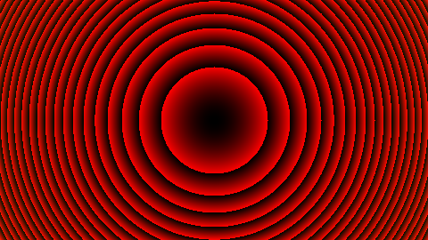
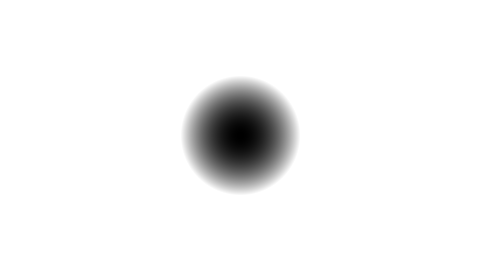
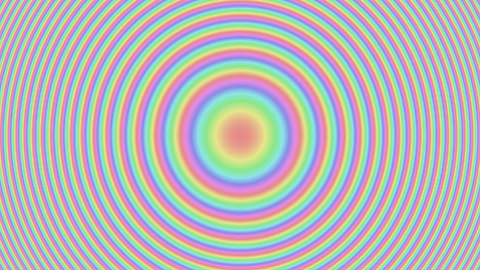
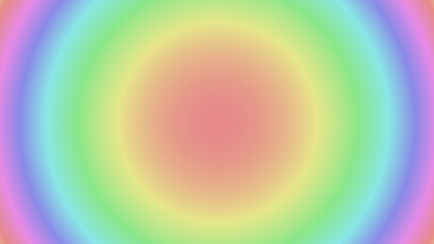
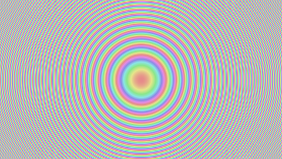
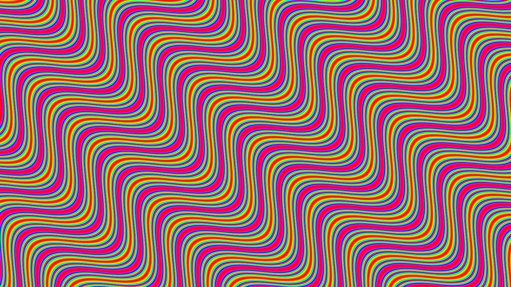
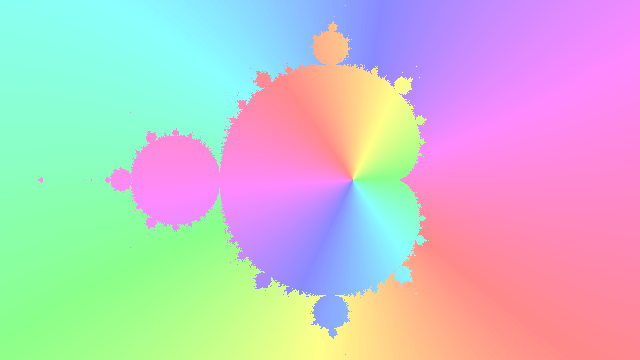
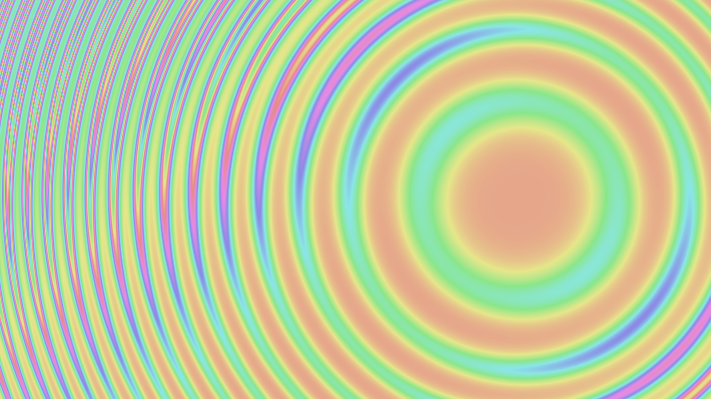
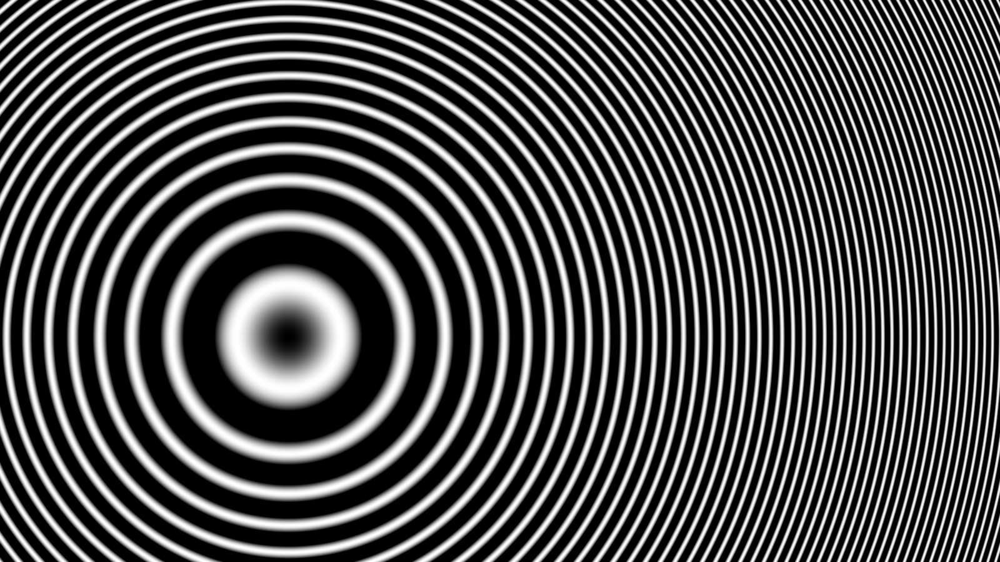

# colorExplorer
### Aesthetic 2D visualization of functions

The objective of this project is to explore the artistic aspects of two-dimensional mathematics. To put it simply, it is about visualizing a function in 2D, but with fancy colors and some extra options. It is not very useful, but we like it. If you're interested, we'd be delighted to see your creations, and exchange tips !

## Install & Run
### Ubuntu, python3

To run the project, navigate to the project's folder and run:
```
python3 colorExplorer.py
```
You will first need to ```pip install importlib``` for the **userdef** entry to work properly.

You might also need to install the following python libraries (but you probably have these already):
```
python3-tk
python3-pil.imagetk
python3-numpy
python3-scipy
python3-matplotlib
```

## Tutorial
The first thing to know is that each pixel on the picture corresponds to a unique ```(i,j)``` value. In particular, the point in the center is at ```(0,0)```. For example, the function ```100*(i**2+j**2)``` takes the form of concentric circles after coloration by function value.

**colorExplorer** provides 3 different color-representation modes. Here is how the previous example looks under each color mode:

RGB | B&W | HSV
:-------------------------:|:-------------------------:|:-----------------------:
 |  |  

If you want to experiment with different visualization effects of a function, try out the sliders. For example, you can add an ```α``` or a ```β``` in your function to change the amplitude of the entire (or parts of the) function. ```α*(i**2+j**2)``` looks very different under ```α=5``` and ```α=200``` :

```α=5``` | ```α=200```
:-------------------------:|:-----------------------:
 |  |  

## Example creations  
example | example    
:-------------------------:|:-----------------------:
 |   |
 |  |
 |  |
 |  |

## Troubleshooting

If the canvas doesn't update anymore, you probably have a problem. If available, check the console for errors. From there, you should be able to rectify your formula, unless you get one of the following errors:
- "Name 'X' is not defined" -> don't forget to add **user.** for the userdef entry and **slider.** for slider values 
- "Module userdef has no attribute 'X'" -> don't forget to ```pip install importlib```

If that didn't help, please do not hesitate to contact us so that we can fix your problem and add it to the troubleshooting tips.
