# Aesthetic Functions
### 2D visualization of functions

The objective of this project is to explore the artistic aspects of two-dimensional mathematics. To put it simply, it is about visualizing a function in 2D, but with fancy colors and some extra options.

## Install & Run

To run the project, navigate to the project's folder and run:
```
python3 main.py
```

## Tutorial
Each pixel on the picture corresponds to a unique ```(i,j)``` value. In particular, the point in the center is at ```(0,0)```. For example, the function ```100*(i**2+j**2)``` takes the form of concentric circles.

### Color models

**aesthetic-functions** provides 3 different color-representation models. Here is how the previous example looks using each color model:

RGB | B&W | HSV
:-------------------------:|:-------------------------:|:-----------------------:
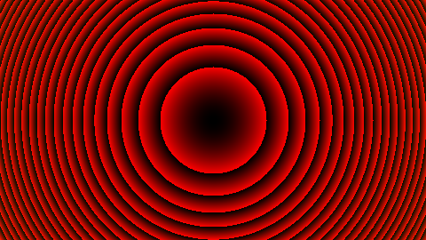 | 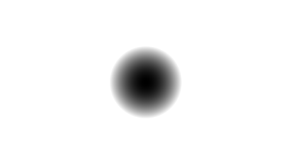 |  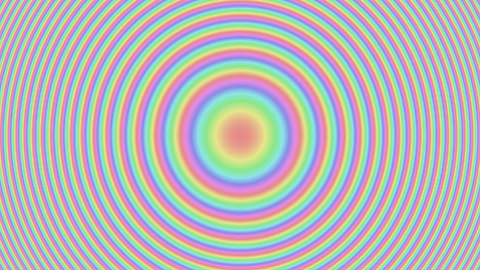

### Sliders

In order to add interactivity to your plot, you can add sliders. Just enter the slider's name and use `slider.XXX` in your formula.

<p align="center">

</p> 

### User definitions

The user definition entry can be used to define additional python code. Anything you define there can directly be used in the formula using the prefix `user.XXX`.

<p align="center">

</p> 

### Mouse interactions

Mouse is fully integrated and can be used to move or zoom on the canvas.

<p align="center">

</p> 

## Example creations  
example | example    
:-------------------------:|:-----------------------:
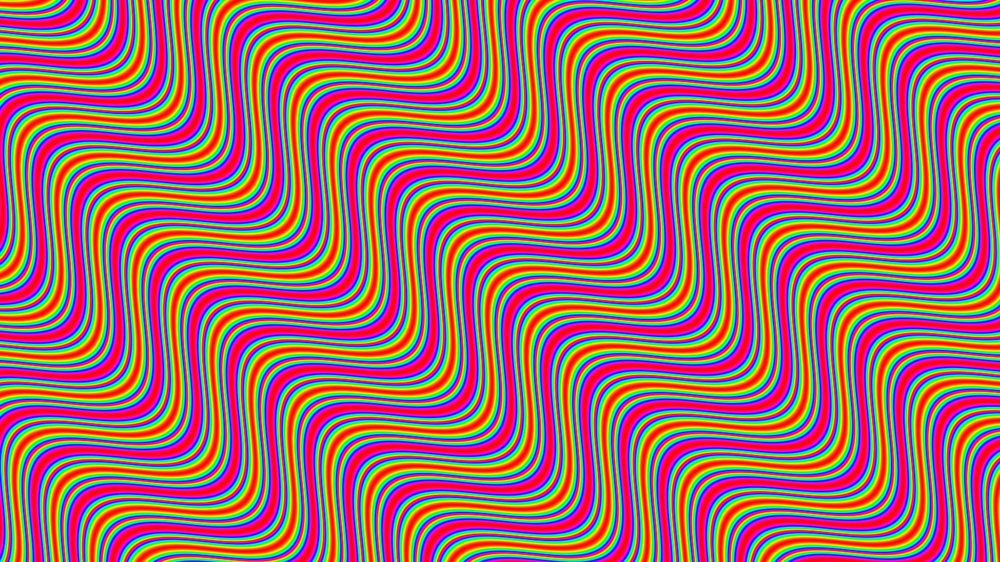 |  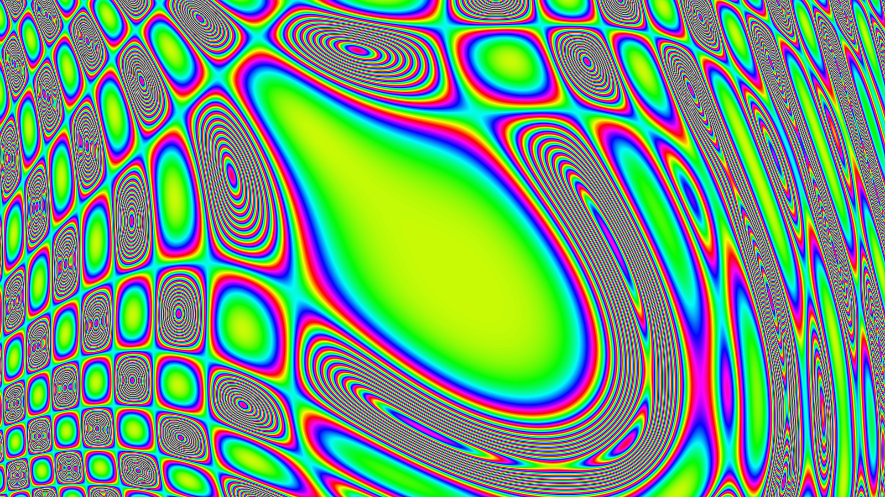 |
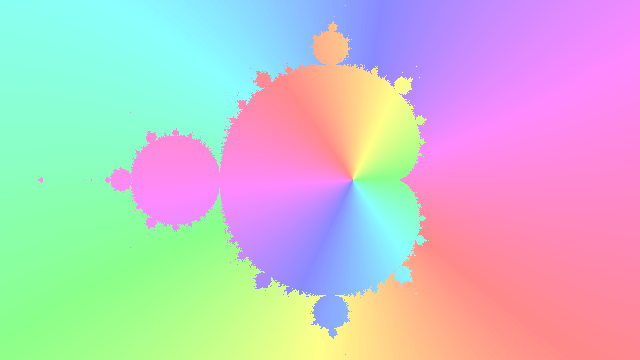 | 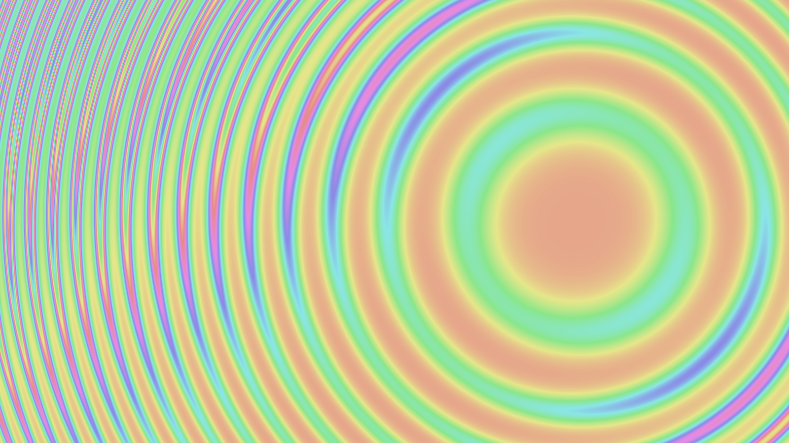 |
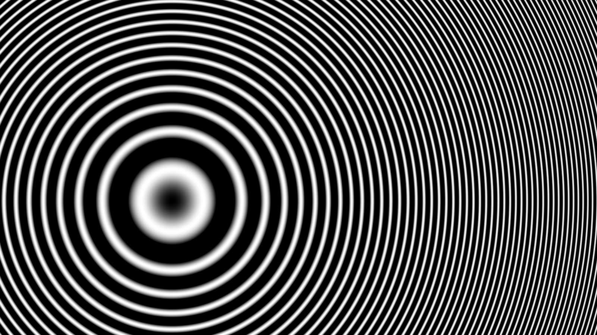 | 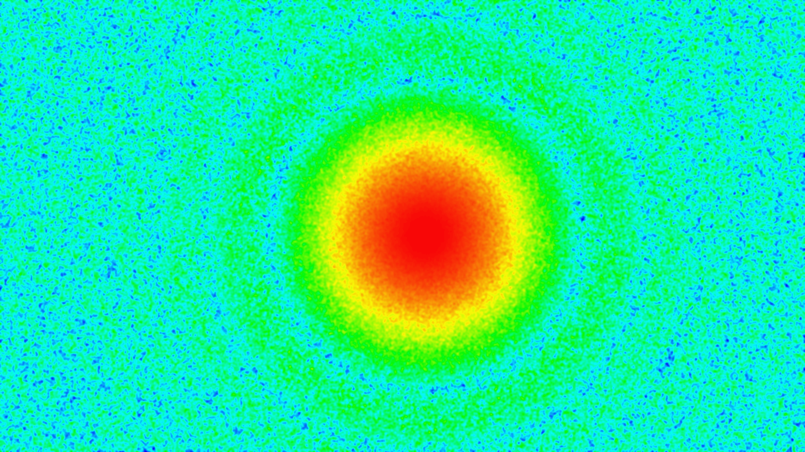 |
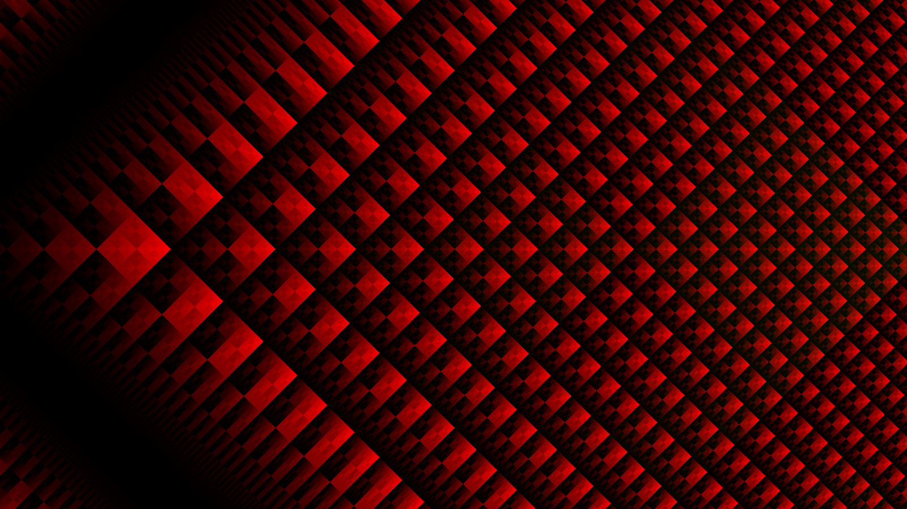 | 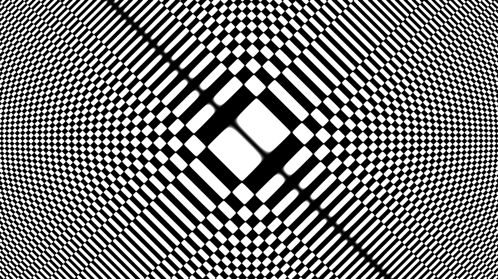 |

## Troubleshooting

If the canvas doesn't update anymore, there's probably a problem with your inputs. Check the error labels on the interface to see where you made a mistake. If that's not enough, check the console for error messages. From there, you should be able to rectify your formula and definitions.

- Don't forget to add **user.** for the userdef entry and **slider.** for slider values 
- Don't use the sliders in the user definition entry (pass them as parameters to your function instead)
- Check your function is written in valid Python and returns a value or an array with appropriate size

If that didn't help, please do not hesitate to contact us so that we can fix your problem and add it to the troubleshooting tips.